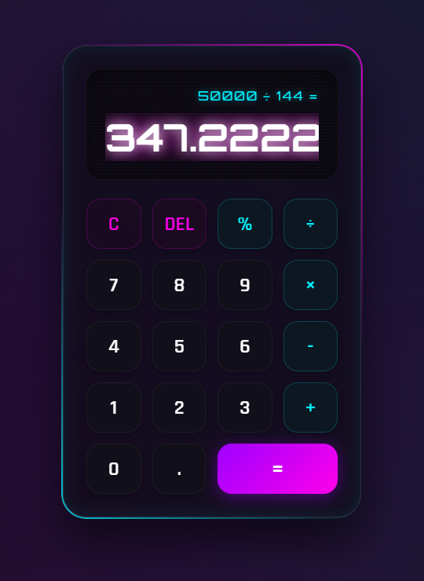
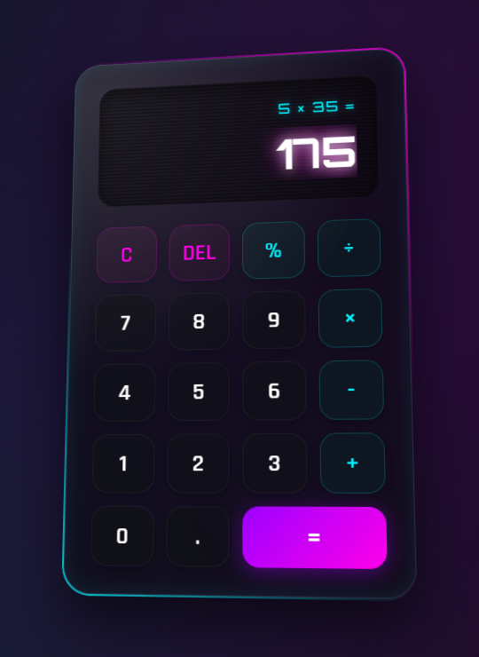
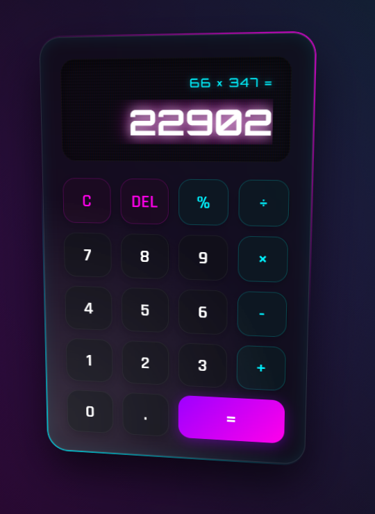

# 🧮 QuantumCalc: 3D Immersive Calculator


QuantumCalc is not just a calculator; it's a visual experience. Built with **React 19** and **Vite**, this application features a high-performance, interactive 3D interface with glassmorphic aesthetics and realistic light physics.

---

## ✨ Key Features

-   **🌌 Immersive 3D Tilt**: The interface reacts to your cursor movement with a smooth, perspective-based 3D rotation and dynamic glare effect.
-   **⌨️ Full Keyboard Support**: Operate the calculator entirely from your keyboard (Numbers, Operators, Enter for equals, Backspace for DEL, and Escape for Clear).
-   **💎 Glassmorphic Design**: A premium look featuring frosted glass textures, neon borders, and subtle animations.
-   **⚡ High Performance**: Utilizing React's `useCallback` and `useRef` for optimized rendering and 60fps interaction.
-   **📱 Fully Responsive**: Seamlessly adapts to any screen size while maintaining its 3D depth and interactivity.

---

## 📸 Project Showcase

> [!TIP]
> Move your mouse over the calculator to experience the dynamic 3D tilt and light reflection!

| Normal | Tilt | Tilt |
| :---: | :---: | :---: |
|  |  |  |

---

## 🚀 Tech Stack

-   **Frontend Library**: React 19 (Hooks: `useState`, `useEffect`, `useCallback`, `useRef`)
-   **Build Tool**: Vite (Lightning fast HMR)
-   **Styling**: 
    -   CSS Modules (Scoped styles)
    -   Bootstrap 5 (Layout architecture)
    -   Vanilla CSS (Custom 3D transforms & Glare effects)
-   **Interactivity**: Native JavaScript Mouse Tracking for 3D physics.

---

## 🛠️ Installation & Setup

1.  **Clone the repository**:
    ```bash
    git clone https://github.com/Imtiaz-Ali17314/QuantumCalc-3D-Immersive-Calculator-React-Project
    ```

2.  **Navigate to the project directory**:
    ```bash
    cd QuantumCalc-3D-Immersive-Calculator-React-Project
    ```

3.  **Install dependencies**:
    ```bash
    npm install
    ```

4.  **Run the development server**:
    ```bash
    npm run dev
    ```

5.  **Build for production**:
    ```bash
    npm run build
    ```

---

## 🧠 Logic Highlights

The core arithmetic logic is handled via a centralized `handleAction` function wrapped in `useCallback` to prevent unnecessary re-renders. It manages:
-   **Floating-point precision**
-   **Expression chaining**
-   **Operator precedence**
-   **Real-time keyboard event listeners**

---

## 🎨 UI/UX Philosophy

The project prioritizes "Visual Excellence" as defined by modern web standards. By combining **CSS Perspective** with **Dynamic JS-driven transforms**, the application bridges the gap between traditional utility tools and modern interactive art.

---

Developed with ❤️ by Imtiaz Ali
